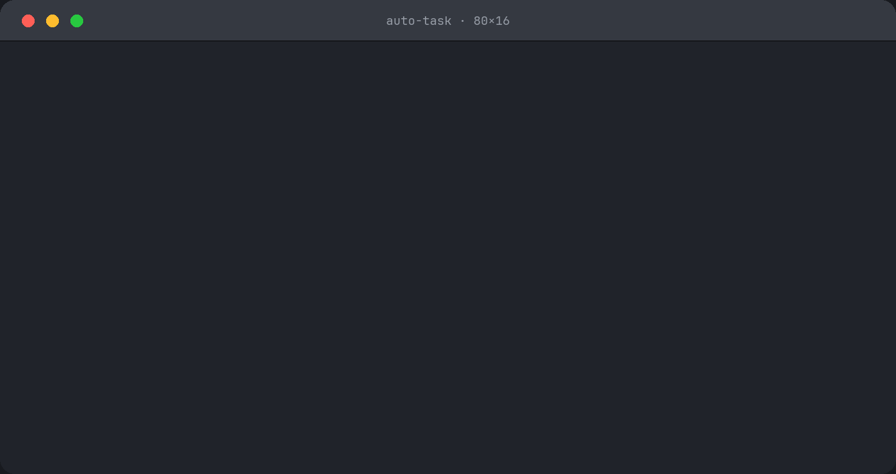

# auto-task

An opinionated agentic workflow to turn well-defined units of work into shippable code with minimal human input.

> [!NOTE]
> This is a very early extract from my daily workflow — rough edges included. Feedback, Issues and PRs welcome!

_auto-task_ aims to deliver high-quality code with high autonomy. To achieve this, it combines human-curated skills with research-backed techniques: workspace isolation, persistent task state, fresh-context subagents, multi-model-family panels and synthesis, TDD, evidence-cited triage, and more.

Built for experienced engineers who want to ship software at an accelerated pace but remain in control while doing so.

**Think cruise control, not Full Self-Driving.**

<p align="center">
  
</p>

"Marketing version" of an auto-task run above. For a real run, see [this sample transcript](examples/runs/083-persist-column-picker.md).

## How It Works

At a high level, a typical _auto-task_ session looks something like this:

1. **Explore:** You explore a topic — a product increment, a bug, an issue, a refactoring, etc.
2. **Scope:** Once your idea of what to build converges, you crystallise it into a *well-defined task* via `/at:create-task`.
3. **Build:** You hand the task over to agents to complete with full autonomy via `/at:auto-task`.
4. **Ship:** You review the work, potentially give feedback, and ship via `/at:ship-task`.

Under the hood, these steps unfold as a fixed pipeline:

```text
create → [ preflight · clarify · worktree · plan · impl · review · triage · fix · verify ] → ship
(human)                                     (auto-task)                                   (human)
```

### Steps

The pipeline in detail. Create and clarify are interactive; everything else inside `/at:auto-task` runs autonomously; the ship decision stays with you. Every step backed by a skill also runs standalone. The Plan, Review and Verify rows describe full mode — small single-package changes downshift to `--lite` automatically (see [Flags](#flags)).

| Step              | What happens                                                                                                                                                                                | Skill               |
| ----------------- | ------------------------------------------------------------------------------------------------------------------------------------------------------------------------------------------- | ------------------- |
| **Create**        | You crystallise an exploration into a task file — intent, acceptance criteria, notes. A tighten pass cuts anything a capable agent could infer itself.                                      | `/at:create‑task`   |
| **Preflight**     | Checks the roster is actually alive — second model, verification command, design-review server — so a run that would die twenty minutes in stops now, not later.                            | —                   |
| **Clarify**       | Pressure-tests the task: would two agents given the task build the same thing and agree when it's done? Gaps come back as focused questions.                                                | `/at:clarify‑task`  |
| **Worktree**      | The task gets an isolated git worktree at a predictable path, with dependencies installed.                                                                                                  | —                   |
| **Plan**          | Two models (Claude + Codex by default) independently write implementation plans; a synthesis merges them without forcing consensus.                                                         | `/at:plan‑task`     |
| **Implement**     | A fresh-context subagent executes the plan test-first (strict TDD), committing as it goes.                                                                                                  | `/at:impl‑task`     |
| **Review**        | Two independent models review in parallel — a structured Claude review and an adversarial pass from a different model family (Codex by default).                                            | `/at:review‑code`   |
| **Design review** | UI changes only: boots the app and measures the rendered result against a design spec — geometry, tokens, real interaction states.                                                          | `/at:review‑design` |
| **Triage**        | Every finding is accepted or rejected with cited evidence; mechanically certain trivia auto-fixes. It can accept on its own, but never rejects a Critical or Major finding without you.     | —                   |
| **Fix**           | Accepted findings are fixed test-first; fixes get re-reviewed.                                                                                                                              | —                   |
| **Verify**        | An independent agent verifies every acceptance criterion against the actual behaviour, not the diff.                                                                                        | `/at:review‑task`   |
| **Ship**          | When the workflow stops and reports what was found, fixed, rejected and why, you decide whether it ships. Shipping squash-merges, verifies the integrated tree, and pushes.                 | `/at:ship‑task`     |

## Tasks

Tasks are the central artefact of the _auto-task_ workflow. They span the entire workflow, accumulating and preserving state across agent sessions. They are plain markdown files stored on disk (default: `tasks/`).

Tasks are created by a human to capture user intent at a behavioural level (i.e. the why and what, not the how). I suggest you use `/at:create-task`, which automatically runs `/at:clarify-task` to pressure-test that a new agent understands what to build. You can also write tasks by hand — but then run `/at:clarify-task` explicitly before handing over, as you should whenever a human has written or modified a task. You may include additional guidance or constraints but generally should avoid specifying implementation details — implementation planning is done later, by agents. Once agents take over, they use the task file to persist implementation plans, track status, log notes, surprises, etc.

Creating well-defined tasks is hard, time-consuming and high-leverage. I spend a good chunk of my time here and obsess over making sure that my intention is clear without over-constraining the model that will pick up the task. I also make sure to size tasks into manageable chunks. As a rule of thumb, I aim to cut scope into tasks that would take a human developer in the olden days between 0.5 and 3 days. Everything below that I usually one-shot; anything above, I break down. Spending time here is well worth it. Don't expect AI to magically turn a vague or sloppily written task into correct software. Sh\*t in, sh\*t out.

Here's a sample task:

```markdown
---
title: Export invoices as CSV
date: 2026-07-10
status: ready-for-dev
type: feat
---

## Export Invoices as CSV

Add a CSV export to the invoices list so customers can pull their data into their own accounting tools.

### Acceptance Criteria

- An Export button on the invoices list downloads a CSV of the currently filtered rows — not just the visible page.
- Columns: invoice number, customer, issue date, due date, status, total. Dates are ISO (YYYY-MM-DD); totals are plain decimals, no currency symbol.
- Fields containing commas, quotes, or newlines are escaped per RFC 4180.
- An export with no matching rows downloads a CSV with the header row only.
- Exports are capped at 10,000 rows for now — larger exports fail with an error pointing at the API.

### Notes

- Async export for large row counts is a later task.
```

For a finished one — plan, implementation notes, post-review fixes — see [tasks/001](tasks/001-at-config-slice-1.md).

## Prerequisites

For now, _auto-task_ works with Claude Code and uses Codex as a second model for multi-model-family panels. If Codex and the Claude Code Codex plugin are not installed, _auto-task_ falls back to same-family models for panels — materially worse in practice (see the FAQ). Using Codex — or another non-Anthropic model (see [Configuration](#configuration)) — as the second model is therefore strongly recommended.

- [Claude Code](https://claude.com/product/claude-code)
- [Codex CLI](https://developers.openai.com/codex/cli) and [openai/codex-plugin-cc](https://github.com/openai/codex-plugin-cc) (to enable multi-model-family planning and review panels)
- [Chrome DevTools MCP](https://github.com/ChromeDevTools/chrome-devtools-mcp) (only required when reviewing UI changes)

## Installation

Open Claude Code and run:

```text
/plugins marketplace add patforna/auto-task
/plugins install at@auto-task
```

## Quick Start

Open Claude Code in your project's git repo:

1. Run `/at:create-task` to capture what to build. Review and tweak the task.
2. In a new session, run `/at:auto-task <task>`.
3. Review what was built, then run `/at:ship-task`.

## Updating

Auto-update is off by default for third-party marketplaces. Turn it on at `/plugins` → **Marketplaces** → `auto-task` → **Enable auto-update**. Claude Code then refreshes the marketplace and updates the plugin within ten minutes of session start.

## Configuration

### Flags

Per invocation, `/at:auto-task` takes two flags:

- `--lite` — single-pass plan, single reviewer, single task review. Cuts the runtime meaningfully. _auto-task_ downshifts to lite automatically for small, single-package changes; pass the flag to force it.
- `--ship` — ship automatically at the end instead of stopping for approval. If a Critical/Major finding needs your call, the ship gate still holds.

### Project Config

Defaults can be overridden per project in markdown.

- Project config: `.claude/auto-task.config.md` — Committed. Shared by everyone in the repo.
- Personal overrides: `.claude/auto-task.config.local.md` — Gitignored. Takes precedence over project config on conflict.

Configurable per project: task store, verification command, worktree layout, standing review context, design-review server, model roster, commit conventions, transcript capture, feedback snapshots. See [`examples/auto-task.config.md`](examples/auto-task.config.md) for every setting with a worked override — copy it into your repo and amend as needed. The shipped defaults live in [`auto-task.config.defaults.md`](auto-task.config.defaults.md), and `/at:config` prints the settings actually in effect with each value's origin.

## Development

Skills live in [`skills/`](skills/), one directory per skill.

Point a marketplace at your checkout. Run once from the checkout root, skipping the first line if you never installed from GitHub:

```text
/plugins marketplace remove auto-task
/plugins marketplace add ./
/plugins install at@auto-task
```

Edits are then live in the next session; `/reload-plugins` applies them to the current one. To go back to the released copy, remove the marketplace and re-add `patforna/auto-task`.

`panel`, `synthesize`, and `tdd` are vendored from [core-skills](https://github.com/patforna/core-skills). Don't edit them here — edit them there and re-vendor:

```sh
scripts/vendor.sh [path-to-core-skills]
```

### Releasing

Users are pinned to `version` in `plugin.json` — pushing to `main` without bumping it ships nothing.

1. Bump `version` in `.claude-plugin/plugin.json` and in the `at` entry of `.claude-plugin/marketplace.json`.
2. `claude plugin validate .claude-plugin/plugin.json`
3. Commit and push.
4. `claude plugin tag --push` — tags `at--v<version>`.
5. `gh release create at--v<version> --notes '…'` — the tag alone publishes nothing readable; say what changed.

## FAQ

**Why not just prompt Claude Code directly?** For small changes, do. The value shows on bigger units of work: a single session reviews its own output (structurally unreliable), drifts as its context fills, and forgets everything between sessions. _auto-task_ replaces that with fresh-context subagents per step, review by a model family that didn't write the code, evidence-cited triage of every finding, and a task file that persists state. It's the discipline you'd apply if you were building without AI, enforced on every run.

**Why tasks and not specs?** I'm coming from an XP lineage and I always had an aversion to "spec" because it implies things are set in stone and there is no room for learning and iteration — waterfall vs iterative development. I was going to go with "[user] stories" but that also didn't feel right because the middle "C" (in "Card, Conversation, Confirmation") doesn't make so much sense in this new age and I'm also aware that the term user stories has accumulated a lot of baggage over the last 20 years or so. "Issues" or "Tickets" didn't feel appropriate either. "Task" felt more neutral and like a good fit.

**Why do tasks live in the repo?** Because agents are great at plain file I/O and the tasks travel with the code: no API, no auth, readable and editable in any worktree or headless session, and the task file rides the same branch as the change it describes. The downsides are real too: task churn shows up in your git history and diffs, and in a public repo the tasks are published with the code. Both alternatives have trade-offs of their own: an issue tracker gives you collaboration features but puts an API between the agent and its state; a separate task repo keeps the code history clean but the task no longer travels with the branch. The task store is configurable — I currently keep my own tasks in a sibling repo for the history-noise reason.

**Do I need Codex?** No, but the cross-family review is materially better than single-family review — it's the part of this workflow that has most reliably caught real bugs. Any second model family can fill the role via the Models setting.

**How long does a run take?** Expect a full run on real work to take ~20–40 minutes and spend a decent amount of tokens. `--lite` about halves it.

**Why does it merge straight to main — no PRs?** Because by ship time the change has been reviewed harder than most PRs ever are: two model families, adversarial passes, evidence-cited triage, AC-by-AC verification — plus you at the ship gate. Also, the workflow comes from solo trunk-based development; if your team requires PRs, the ship step is the natural seam to adapt.

**Can I use just parts of it?** Yes. Most steps are their own `/at:` skill and run standalone — `/at:review-code` on any diff, `/at:create-task` without the orchestrator, `/at:panel` for a multi-model take on anything. Type `/at:` in Claude Code for the full list.

**Can I run multiple tasks in parallel?** Yes. Each task gets its own worktree, so parallel runs don't collide during implementation, assuming your build process and environment are hermetic (e.g. separate server instances running on separate ports, etc.). Make sure you ship serially though: shipping merges in the primary checkout, and concurrent ships race each other.

**Why markdown config and not TOML/JSON?** Nothing parses the config — an agent reads it. Several entries are irreducibly prose (standing review context, domain review rules); the rest read better as one-line instructions than as string values quoted inside config syntax.

**Where did this come from?** 6+ months of full-time agentic solo development on a quant trading codebase, shaped by XP, years at Thoughtworks and Google, and deep literature research (see [docs/research](docs/research)).

## Licence

MIT — see [LICENSE](LICENSE).
